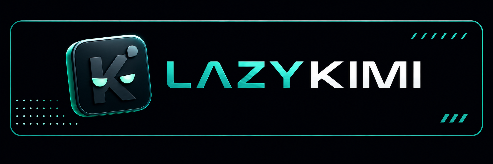

# LazyKimi



> Kimi-native evidence-led agent workflow harness for **Kimi Code CLI** (primary)
> and **Kimi Work** (experimental full-plugin route, skills fallback). Current release:
> **v1.3.4**, at family parity with LazyZCode v1.3.4.

> **Verified on macOS only.** Linux and Windows paths and host behaviour are
> unverified. Package checks prove the copied package and its local contracts;
> a Kimi Code CLI or Kimi Work session remains the authority for plugin loading,
> hooks, and MCP connection.

> **Honest-claims discipline.** Package evidence proves copied files and
> declarations, not plugin loading, SessionStart, hooks, or an MCP connection.
> A Kimi Code CLI or Kimi Work session must confirm connection.

LazyKimi is a self-contained workflow harness that recreates the
[LazyBuddy](https://github.com/elvinzhao10/LazyBuddy) and
[LazyTrae](https://github.com/elvinzhao10/LazyTrae) evidence-led agent workflow
harness design as a Kimi-native package. It targets Kimi Code CLI (primary
host) and Kimi Work (secondary host, full-plugin activation unverified). The canonical design
reference is [lazycodex/OmO](https://github.com/code-yeongyu/lazycodex).

## Start with the outcome

State the result you need, the acceptance criteria, and the surface that must
prove it. Use the smallest workflow that fits the uncertainty and risk:

| Situation | Ask for | Why |
| --- | --- | --- |
| Small, well-understood change | A normal request | Avoid process for process's sake. |
| Unfamiliar repository | `lazy-init-deep` | Establish project-local instructions and context. |
| Broad or ambiguous change | `lazy-ulw-plan` | Make decisions reviewable before editing. |
| Approved plan | `lazy-start-work` | Execute against explicit acceptance criteria. |
| Failure | "Debug why … fails" | Reproduce, compare hypotheses, and verify the fix. |
| Material-risk completion | `lazy-review-work` | Add independent quality, QA, security, and scope checks. |
| Long-running goal | `lazy-ulw-loop` | Keep durable state and checkpoints. |

In a Kimi Code CLI session, skills are invoked via `/skill:lazy-<name>` or the
`/<name>` shorthand. Kimi Work supports full plugins; this package's full-plugin
activation remains experimental, with a skills import fallback through its Skills UI.
Kimi Code CLI documents native `/swarm`, `/goal`, and `/plan` modes. Equivalent
Work mode behavior has not been verified for this release.

## Design mindset

LazyKimi treats a task as an evidence problem: define the observable outcome,
keep authority with the host and user, choose local tools before heavier
providers, and finish by exercising the surface the user actually cares about.
A passing unit test is useful evidence, not automatically proof of a CLI, API,
page, or host integration.

The package never turns its own readiness check into a claim about a running
host. It keeps package-owned state separate from marketplace state, host MCP
registrations, credentials, and live sessions.

## Repository structure

```
lazykimi/
├── AGENTS.md              # Agent instructions (onboard/offboard, conventions)
├── LICENSE                # MIT publication copy
├── NOTICE                 # Upstream attribution publication copy
├── README.md              # This file (project overview)
├── CODE_OF_CONDUCT.md     # Regular publication copy
├── CONTRIBUTING.md        # Regular publication copy
├── SECURITY.md            # Regular publication copy
├── docs/                  # Regular publication pages with rebased local links
├── lazykimi-evaluation.md # Public verification evidence
├── lazykimi-plugin/       # The installable plugin package (see lazykimi-plugin/README.md)
│   ├── .kimi-code/         # Kimi Code CLI host entry (skills, mcp.json, AGENTS.md)
│   ├── agents/             # 13 family role-agent definitions
│   ├── commands/           # 20 named slash-command workflows
│   ├── hooks/              # 16 hook event declarations + shell scripts
│   ├── mcp/                # 6 local MCP servers (bash + Python stdio, 32 tools)
│   ├── src/                # TypeScript `lazykimi` CLI
│   ├── contracts/          # Family-shared + per-host Kimi contracts
│   ├── tooling/            # Adaptive tooling layer (locked node dependencies)
│   ├── scripts/            # State, loop, lifecycle, and verification utilities
│   └── docs/               # Numbered technical architecture pages + reference/
└── sources/                # Read-only reference repos (LazyBuddy, LazyTrae, lazycodex)
```

## Install and onboard

Start from the immutable release, open the cloned folder in the host you want
to use, and type `onboard` in the agent chat:

```bash
git clone --branch v1.3.4 https://github.com/elvinzhao10/LazyKimi.git
cd LazyKimi
```

`onboard` asks whether you use Kimi Code CLI or Kimi Work, then follows only
that route from [AGENTS.md](AGENTS.md), stops before changing host-managed
settings, and tells you the exact command, skill, and MCP status to confirm in
a new session.

For full installation routes (plugin manifest vs. project config), hook
installation, MCP configuration, and uninstall, see
[lazykimi-plugin/README.md](lazykimi-plugin/README.md).

## Verify and remove

```bash
lazykimi load-check
lazykimi doctor
lazykimi verify --must-pass
```

These read-only reports cover copied assets and declarations. The installed
layout contains 19 skills, 20 commands, 13 agents, sixteen hook scripts across
sixteen events, and six MCP server declarations exposing 32 tools. The MCP
servers expose tools only after a host connection.

Type `offboard` for the matching safe-removal protocol; it never guesses or
removes host-managed paths.

## Package inventory

| Surface | Count | Role |
| --- | ---: | --- |
| Skills | 19 | Host-facing workflow policies for planning, execution, review, and verification. |
| Commands | 20 | Named host entry points for those workflow policies. |
| Agents | 13 | Family role definitions mapped to Kimi Code CLI's three sub-agent channels plus the main session. |
| MCP declarations | 6 | Local services for ledger, verification, status, context, code intelligence, and docs (32 tools). |
| Hooks | 16 | Hook event declarations; the critical 8 install into `~/.kimi-code/config.toml`, all 16 ride the plugin manifest. |

## Documentation

- [Plugin README](lazykimi-plugin/README.md) — installation, usage, MCP servers,
  hooks, skills, agent list, workflow phases, and evidence gates.
- [Docs index](docs/) — numbered technical architecture pages (00-11) plus the
  reference set ([host routes](lazykimi-plugin/docs/reference/host-routes.md),
  [hook policy](lazykimi-plugin/docs/reference/hook-policy.md),
  [model routing](lazykimi-plugin/docs/reference/model-routing.md),
  [state model](lazykimi-plugin/docs/reference/state-model.md)).
- [Kimi Work setup](docs/11-kimi-work-setup.md) — secondary host setup walk-through.
- [Evaluation evidence](lazykimi-evaluation.md) — public verification report
  with capability comparison to LazyBuddy, LazyTrae, and lazycodex.
- [AGENTS.md](AGENTS.md) — onboard/offboard protocol and project conventions.

## Technical reference and evaluation

The source-level explanation lives in [docs/](docs/). It maps the package
structure, request flow, state model, security boundaries, MCP lifecycle, and
release checks with diagrams tied to the implementation.

For a capability-by-capability comparison with the original LazyBuddy, LazyTrae,
and lazycodex designs, including what LazyKimi implements and where it
intentionally differs, see [lazykimi-evaluation.md](lazykimi-evaluation.md).

LazyKimi is primarily inspired by lazycodex/OmO. Its relationship to upstream
sources (LazyBuddy, LazyTrae, lazycodex) is recorded in [NOTICE](NOTICE). It is
an independent implementation and does not require LazyBuddy, LazyTrae, or
lazycodex at runtime.

## License

[MIT](LICENSE). See [NOTICE](NOTICE) for attribution and provenance.

## Contributing

Issues and pull requests are welcome. Read [CONTRIBUTING.md](CONTRIBUTING.md)
for the development checks, release expectations, and guidance for reporting
sanitized reproduction details. Report vulnerabilities privately according to
[SECURITY.md](SECURITY.md).
