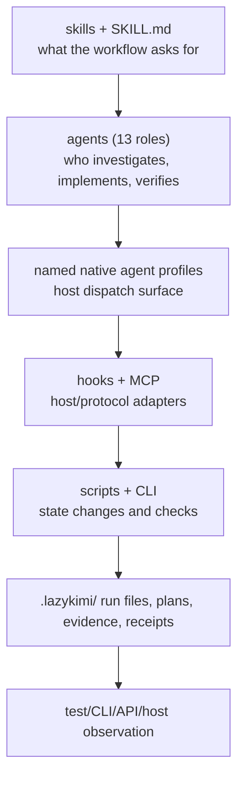

# Execution model

LazyKimi separates *policy*, *execution*, *durable state*, and *proof*. That
separation prevents a descriptive Markdown file, an installed declaration, or
a passing local check from being mistaken for a live host capability.

## Policy is not execution

Skills describe how an agent should approach planning, debugging, review, or
completion. Agent files narrow that guidance to a role and declare native
tool and delegation restrictions. They do not gain authority merely by existing: a
host must select and load them, and an agent must still perform the described
work.

## Execution is not proof

The shell scripts and the TypeScript CLI are the operational layer. They
create run records, validate state, run bounded checks, and format
machine-readable results. Their output establishes local package evidence.
Proof must be chosen for the requested surface: a test for library behavior, a
CLI invocation for a CLI, a browser check for a page, or an observed host
session for an integration.

## The planner/implementer/verifier separation

LazyKimi declares thirteen named native profiles. The orchestrator delegates
through Agent/AgentSwarm; each worker declares supported `tools`,
`disallowedTools`, and `subagents` restrictions.

Planning and review profiles are read-only and return their results to the
caller; the authorized caller persists plan or review artifacts. Implementation
and QA profiles have execution tools. The verifier can run checks and write
evidence but cannot use Edit or delegate. Shell and path permissions remain
separate host policy: a tool allowlist is not a filesystem sandbox.

Independent planning, implementation and acceptance remain workflow
requirements. Their enforcement depends on the loaded native profiles,
permission policy and evidence gates, and must be observed in the host.
See [native-adapter.md](reference/native-adapter.md) for the exact boundaries.

## Host ownership stays external

The package can check manifest structure, local declarations, executable bits,
and protocol fixtures. It cannot prove plugin discovery, SessionStart, hook
execution, Skills activation, or a connected MCP session. Those are host facts.
This distinction is central to
[05 — Evidence and completion](05-evidence-and-completion.md).
