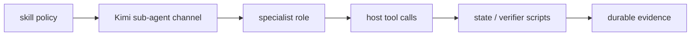

# Workflow playbooks

LazyKimi is a workflow harness, not a promise that every host surface has
loaded it. Start with the smallest workflow that fits the request, and keep
host observations separate from package evidence.

## Choose a workflow

| Situation | Start with | Outcome |
| --- | --- | --- |
| Need a map of an unfamiliar repository | `lazy-init-deep` | Hierarchical project memory and a `.lazykimi/context/` knowledge base. |
| Request is vague, large, or has design choices | `lazy-ulw-plan` | One decision-complete plan; it does not implement product code. |
| An approved plan is ready to execute | `lazy-start-work` | Orchestrated delegation, evidence, and review gates. |
| Completion must stay open until criteria have proof | `lazy-ulw-loop` | Goals with binding success criteria and recorded evidence. |
| A completed change needs independent review | `lazy-reviewer` | Review lanes: goal, QA, code, security, context. |
| A bug has uncertain runtime cause | `lazy-debugging` | Hypotheses tested against observed runtime state. |
| A bounded cleanup follows green regression tests | `lazy-remove-ai-slops` | Behavior-preserving cleanup. |
| You need structural code search | `lazy-ast-grep` | AST-pattern search and rewrite. |
| You need to adapt LazyKimi to a foreign host | `lazy-migration-planner` | Migration plan; no product code. |
| You need to reconstruct a prior session | `lazy-coding-agent-sessions` | Session history and transcript reconstruction. |
| You need to report a LazyKimi bug | `lazy-report-bug` | Structured bug report. |

Kimi Code CLI exposes skills via `/skill:lazy-<name>` or `/<name>` shorthand
after the host has loaded `.kimi-code/`. In Kimi Work, use a verified Skills
session or the equivalent natural-language/imported-skill workflow. The
[installation and host verification guide](03-install-and-host-verification.md)
explains the initial route.

## The normal path

1. Establish the package and host boundary with
   [verification](05-evidence-and-completion.md).
2. For work with unclear decisions, plan first with `lazy-ulw-plan` (or
   `/plan on` then the `plan` sub-agent).
3. Start an approved plan with `lazy-start-work`; that role delegates rather
   than directly implementing product code.
4. Gather the checks and real-surface evidence appropriate to the change.
5. Use `lazy-reviewer` when the work merits the multi-lane gate, then record
   the result in durable project memory with `lazy-librarian` when applicable.

`lazy-ulw-plan` is deliberately sticky: a request to build something becomes
planning until the user explicitly starts the plan. This prevents a plan from
quietly becoming unreviewed implementation.

## Kimi-native mode playbooks

| Mode | When to invoke | Owner | Output |
| --- | --- | --- | --- |
| `/swarm <task>` | Explore phase (parallel explorer + librarian + context-miner); parallel independent task implementation; parallel review lanes | Orchestrator dispatches | Heartbeat markers and deliverables under `.lazykimi/team/members/<id>/` |
| `/goal <objective>` | Implement phase when the work is a single large objective rather than a checklist | Orchestrator oversees | Full Explore -> Plan -> Implement -> Verify -> QA loop; context-indexer reconstructs on resumption |
| `/plan on` / `/plan off` | Plan phase; turn off before Implement | Orchestrator selects host mode | Read-only profiles return plans; the authorized caller persists their artifacts |
| `/yolo` | (optional) User explicitly accepts risk of skipping approval prompts | User-initiated | Faster execution with reduced gate friction |
| `/auto` | (optional) Automatic tool execution following host permission policy | User-initiated | Host-governed tool automation |

The orchestrator decides when to invoke each mode based on the workflow phase
and task shape. The reviewer and verifier may be invoked as peers inside a
`/swarm` or as the closing checkpoint of a `/goal`.

## Command and skill inventory

The package contains 19 portable `lazy-` skills (v1.3.4: `lazy-lcx-report-bug`
renamed to `lazy-report-bug`; `lazy-review-work` and `lazy-ultrawork` added).
The skill inventory is: `lazy-ast-grep`, `lazy-coding-agent-sessions`,
`lazy-debugging`, `lazy-frontend`, `lazy-git-master`, `lazy-init-deep`,
`lazy-librarian`, `lazy-migration-planner`, `lazy-programming`,
`lazy-refactor`, `lazy-remove-ai-slops`, `lazy-report-bug`,
`lazy-review-work`, `lazy-reviewer`, `lazy-start-work`, `lazy-ultrawork`,
`lazy-ulw-loop`, `lazy-ulw-plan`, and `lazy-verifier`.

Twenty `lazy-*` command documents under `commands/` provide the named host
entry points, including the lifecycle commands (`lazy-onboard`,
`lazy-update`, `lazy-status`, `lazy-offboard`, `lazy-resume`, `lazy-new-run`)
that wire to the durable lifecycle CLI.

Skills are host invocation surfaces and workflow policy. They are not proof of
live host loading.

## How policy becomes behavior

The playbooks are deliberately declarative. `.kimi-code/skills/lazy-*/SKILL.md`
tells an agent which evidence and constraints matter; agents narrow the prompt
to a specialist role and declare the Kimi sub-agent channel. The operational
side effects live elsewhere, in scripts, hooks, MCP endpoints, and the project
being changed.

This split is intentional. A host can expose a skill without exposing a slash
command, and a declared agent can exist without being selected for a task. The
package tests the files and local scripts; actual selection and execution are
host/session observations.

Next: learn what counts as completion in
[evidence and completion](05-evidence-and-completion.md), or see the complete
[package map](07-package-map.md).
