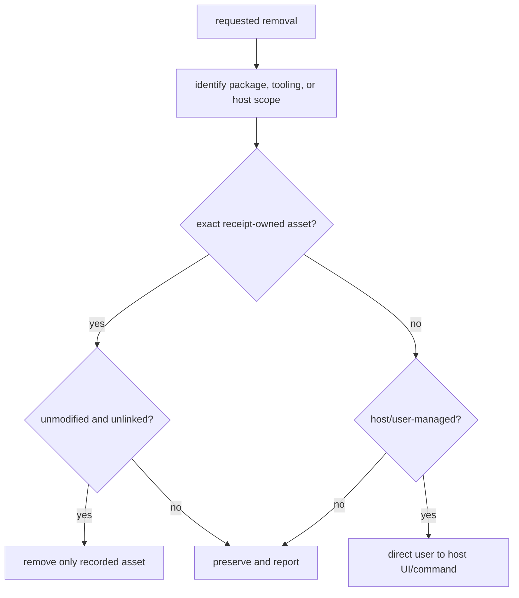

# Safe removal

Remove host-managed integration through its host, and remove package-owned
tooling only when its receipt proves ownership. These are separate operations.

## Remove by installation route

| Route | Safe action | Preserve |
| --- | --- | --- |
| Kimi Code CLI project configuration | Run `lazykimi uninstall --yes` from the selected project; review any retained hook blocks against that project's exact installation paths and receipt. | Host state, credentials, unrelated MCP entries, modified/unknown assets and runtime state. |
| Kimi plugin-manager installation | Uninstall the selected LazyKimi plugin through `/plugins`; confirm the result in a fresh session. | Other plugins, project assets and host settings. |
| Kimi Work imported skills | Remove imported LazyKimi skills through the Skills UI; remove manually configured MCP connectors through Kimi Work's MCP configuration. | Other imported skills, connectors, and host settings. |
| Durable lifecycle installation | Run lifecycle `offboard` without `--yes` to inspect its plan, then confirm the exact verified root before applying it. | Project files and host settings; modified/unknown durable contents block removal. |
| Receipt-owned tooling root | Use the tooling lifecycle removal command for the explicit verified tooling root. Project `uninstall` is a different scope. | Modified, foreign, linked, caller-owned, project, global, and host-managed paths. |

## Package uninstall

```bash
# Run from the exact project directory initialized by LazyKimi.
lazykimi uninstall --yes
```

The command removes only package-owned assets under `.kimi-code/` and
`.lazykimi/` that match an exact ownership receipt. It checks for an exact
ownership receipt and owned contents; it does not use a path name as proof of
ownership. If a root is modified, linked, foreign, or caller-owned, it is
preserved rather than removed. Missing, empty, malformed or unsafe receipts
authorize no deletion. Individual MCP keys are checked separately; unrelated
keys and fields survive. Runtime state is preserved even with `--purge-state`
when no receipt ownership exists.

## Durable lifecycle offboarding

Project removal and durable installation removal are separate operations:

```bash
node lazykimi-plugin/scripts/lazykimi-lifecycle.js offboard \
  --install-root <absolute-install-root> --project <absolute-project> --json
```

Without `--yes`, the command inspects the installation and returns a removal
plan (`confirmation_required`, exit 2) or a blocked result. After reviewing
that exact plan, rerun with `--yes` to remove only verified receipt-owned
durable state. Do not bypass modified/unknown-content refusals or delete the
install root recursively. This does not remove the project route or host plugin.

## Manual host step

After the package uninstall, perform the manual host step:

### Kimi Code CLI

1. Open the selected host's `config.toml` (`KIMI_CODE_HOME` when set, otherwise
   `~/.kimi-code/`).
2. Review retained hook blocks and remove only those whose exact absolute
   command path belongs to this project's established installation. A shared
   `.kimi-code/hooks/` substring is not proof of ownership. The critical eight
   events are SessionStart, UserPromptSubmit, PreToolUse, PostToolUse,
   PostToolUseFailure, Stop, PermissionRequest and PermissionResult.
3. Save the file.
4. In a Kimi Code CLI session, inspect `/mcp-config` and remove only connectors
   explicitly installed for this route and project. A `lazykimi-*` name alone
   does not authorize removal of a modified or independently configured entry.
5. Restart the Kimi Code CLI session.

### Kimi Work

1. Open Kimi Work's Skills UI.
2. Remove only the selected imported LazyKimi skills whose ownership is established;
   preserve modified/unknown skill directories.
3. Open Kimi Work's MCP configuration.
4. Remove only the manually configured connectors belonging to this installation.

## What not to remove

Never guess or scan for host-managed installation paths. Do not delete
`~/.kimi-code/` global state, `~/.kimi-code/config.toml` provider/model
configuration, credentials, another host's MCP configuration, project files,
global tools, or API keys. Removing a tooling root does not authorize removal
of a plugin, marketplace installation, MCP registration, or credential state.

## Confirm the result

Report **package removal** separately from the **user-observed host result**.
After using a host removal UI, confirm that the skills, hooks, and manually
configured connectors are gone in that host. Only then may the copied
repository be deleted; it is independent of host removal and is not itself a
host installer.

## Removal decision flow



The important implementation rule is that a refusal is a successful safety
outcome. `lazykimi uninstall` validates an explicit root and receipt before
deleting package assets; it never turns a filename match, parent directory,
or host plugin name into ownership. Host removal remains a separate user
action because the package cannot safely enumerate host-managed installation
paths.

Read [03 — Install and host verification](03-install-and-host-verification.md)
for the exact boundaries and [06 — Capabilities and approvals](06-capabilities-and-approvals.md)
for the MCP inventory.
