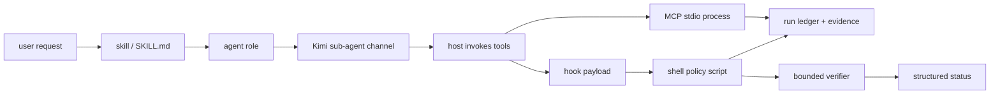

# Architecture tour

LazyKimi is not one runtime. It is a package of declarative host assets plus
small local executables, mapped onto Kimi Code CLI's native sub-agent channels
and native modes. The technical question at every boundary is: *who owns this
file or process, and what observation can prove it ran?*

The arrows are not all automatic. Skills are instructions that a host or agent
may invoke; the host decides whether it loads them. The thirteen agent roles
map to Kimi Code CLI's three built-in sub-agent channels (`coder`, `explore`,
`plan`) plus the main agent, but the host decides which sub-agent to dispatch.
Hook scripts receive host-provided structured input. MCP declarations merely
tell a host how to start a local process. The package can validate every file
in that path, but only a host observation proves loading or connection.

## Package boundary

`lazykimi-plugin/` is the distributable unit. It contains:

- `.kimi-code/skills/` (19), `commands/` (20), `agents/` (13 roles): policy,
  entry points, and role definitions;
- `.kimi-code/mcp.json` and `mcp/`: MCP declarations and local JSON-RPC
  endpoints with their launchers (6 servers, 32 tools);
- `hooks/`: 16 hook event declarations + shell scripts; the critical 8 are
  installed into `~/.kimi-code/config.toml` via `scripts/install-hooks.sh`;
- `src/`: the TypeScript `lazykimi` CLI (init, doctor, load-check, verify,
  mcp, tooling, lifecycle, sync, handoff, completion-status, uninstall);
- `scripts/`: state scripts, loop orchestration, lifecycle machinery, hook
  installation, and verification utilities;
- `contracts/`: family-shared byte-identical contracts plus the per-host Kimi
  set;
- `tooling/`: the adaptive tooling layer with locked node dependencies.

The repository root holds public explanations and evaluation evidence. It is
not required by the package at runtime. Conversely, Kimi Code CLI global
configuration, credentials, host sessions, and the `~/.kimi-code/config.toml`
hooks block are host/user state, not package state.

## State boundary

LazyKimi keeps runtime state under `.lazykimi/` and project configuration
under `.kimi-code/`. The two never mix:

- `.lazykimi/runs/<id>/` — the v1.3.3 run-state model: `state.json`,
  `events.jsonl`, `checkpoints/`, `evidence/`, `verification/`
  (see [reference/state-model.md](reference/state-model.md) for the full tree
  and the v0.x old-to-new mapping).
- `.lazykimi/plans/` — plan files authored by the planner role.
- `.lazykimi/{context,drafts,rules,ulw-loop}/` — knowledge base, planner
  drafts, project rules, and durable loop state.
- `.lazykimi/schemas/` — JSON Schema for the state files.
- `.kimi-code/` — skills, agent catalog, MCP declarations, project rules.

## Follow one real path

Start in [07 — Package map](07-package-map.md). Then trace a workflow request
through [04 — Workflow playbooks](04-workflow-playbooks.md), a persisted record
through the state locations, and a protocol request through the MCP inventory
in [07 — Package map](07-package-map.md). The reference set
([host routes](reference/host-routes.md), [hook policy](reference/hook-policy.md),
[model routing](reference/model-routing.md)) holds the per-surface details.
Finish with [09 — Test and release verification](09-test-and-release-verification.md)
to see how the repository tests each boundary.
