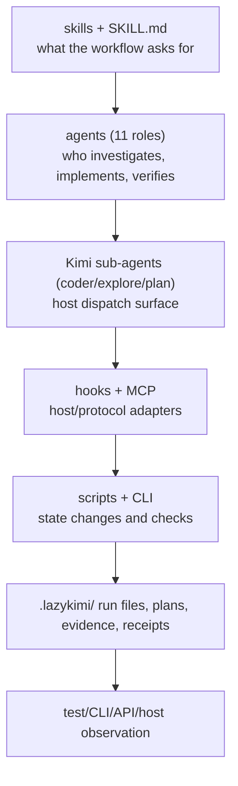

# Execution model

LazyKimi separates *policy*, *execution*, *durable state*, and *proof*. That
separation prevents a descriptive Markdown file, an installed declaration, or
a passing local check from being mistaken for a live host capability.

## Policy is not execution

Skills describe how an agent should approach planning, debugging, review, or
completion. Agent files narrow that guidance to a role and declare which Kimi
sub-agent channel it maps to. They do not gain authority merely by existing: a
host must select and load them, and an agent must still perform the described
work.

## Execution is not proof

The shell scripts and the TypeScript CLI are the operational layer. They
create run records, validate state, run bounded checks, and format
machine-readable results. Their output establishes local package evidence.
Proof must be chosen for the requested surface: a test for library behavior, a
CLI invocation for a CLI, a browser check for a page, or an observed host
session for an integration.

## The planner/implementer/verifier separation

LazyKimi's eleven roles map to three Kimi sub-agent channels plus the main
agent. This mapping is not cosmetic — it enforces the separation the five
evidence gates depend on:

- **`plan` channel**: Prometheus (planner) and Momus (plan reviewer). Both are
  read-only except the single plan file. Prometheus cannot implement; Momus
  cannot approve its own plan.
- **`coder` channel**: Hephaestus (deep implementer), Cleaner (slop removal),
  Migration Planner. These are the only roles with write access to product
  code.
- **`explore` channel**: Explorer, Librarian, Atlas, Metis. All read-only for
  product code.
- **Main agent**: Sisyphus (orchestrator) and Oracle (verifier). Sisyphus
  steers but does not implement; Oracle judges but does not implement.

Collapsing planner and implementer into one agent would let a plan be
rationalized by its own author mid-implementation. Collapsing implementer and
verifier would let the author approve its own work. The sub-agent channel
mapping makes both collapses structurally impossible.

## Host ownership stays external

The package can check manifest structure, local declarations, executable bits,
and protocol fixtures. It cannot prove plugin discovery, SessionStart, hook
execution, Skills activation, or a connected MCP session. Those are host facts.
This distinction is central to
[05 — Evidence and completion](05-evidence-and-completion.md).
