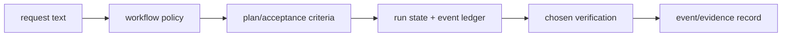

# Request decomposition

The workflow layer converts an open-ended request into three durable concepts:
an outcome, acceptance criteria, and a proof surface. The package does not
parse product intent automatically; skills and agents make these concepts
explicit so later state and verification have something concrete to reference.

## Input shape

An effective workflow request has this conceptual shape:

```text
outcome: what changes for the user
constraints: scope, safety, compatibility, ownership limits
acceptance criteria: observable pass/fail conditions
proof surface: test, CLI, API, browser, or host session
```

`.kimi-code/skills/lazy-ulw-plan/SKILL.md` teaches the planning role to
preserve uncertainty as a decision rather than silently inventing it.
`.kimi-code/skills/lazy-start-work/SKILL.md` assumes that a plan has already
identified the acceptance criteria. This is why planning and execution are
separate files and separate host actions.

## From request to records

The state scripts under `scripts/state/` provide the persistence layer for
the workflow: a run under `.lazykimi/runs/<id>/` contains state, tasks,
checkpoints, an append-only event ledger, and evidence references. The plan
file's checkbox state is the single source of truth for "where are we in the
plan?" — the context-indexer reconstructs from it, the orchestrator advances
it, the verifier reads it to confirm plan compliance
(see [reference/state-model.md](reference/state-model.md)).

The loop helpers operate on that state rather than trying to infer current
work from the latest chat message. A verifier can therefore inspect the
claimed outcome, named checks, and recorded result independently.

## Proof surface selection

The proof surface is intentionally not always a test suite. A library change
may be proved by tests; a command requires a command invocation; a UI needs a
visual/user interaction check; a host integration requires host observation.
The workflow text only directs that selection. The executable verifier records
package-local checks, while the person or host supplies the final surface
observation.

See [Workflow playbooks](04-workflow-playbooks.md) for policy roles and
[07 — Package map](07-package-map.md) for the persisted representation.

## Implementation handoff

The request text is interpreted by policy files first, then becomes state only
when an execution path chooses to record it. `lazy-ulw-plan` defines the
questions that must be answered before implementation; `lazy-start-work`
expects an approved plan and directs evidence collection. The state scripts
turn those ideas into run state (`state.json`), the event ledger
(`events.jsonl`), checkpoints, and evidence references.



Nothing in this flow infers success from the prompt itself. Each transition is
an explicit script, host invocation, or recorded observation; that makes the
result inspectable after the original conversation has ended.

## Kimi-native mode selection

LazyKimi maps the request shape onto Kimi Code CLI's native modes:

- A vague or large request enters `/plan on` and the `plan` sub-agent
  (lazykimi-planner) authors the plan.
- An approved plan with independent tasks may be handed to `/swarm <task>`
  for parallel execution across the `coder` and `explore` channels.
- A single large objective with a clear goal may be handed to
  `/goal <objective>` for durable autonomous execution under the
  orchestrator.

The mode is an execution-channel option chosen at `start-work` time; the plan
itself remains the contract.
