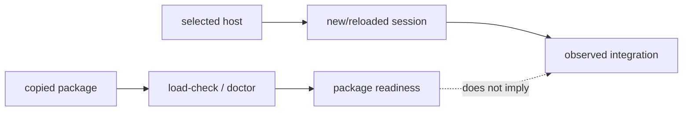

# Package delivery

This page explains the deployment boundary in code terms. A plugin package
contains files a host may load; it does not contain the host's session state,
API keys, or connector process table.

## Copyable versus observed state

`lazykimi-plugin/` can be copied and checked in isolation. `lazykimi load-check`
inspects the selected package root, manifests, inventories, declarations,
executable scripts, and tooling contract. `lazykimi doctor` adds health
diagnostics. Neither command asks a host to install a plugin or open an MCP
connection.

The host is a second runtime. Kimi Code CLI chooses how `.kimi-code/` is
discovered, when hooks receive events, and when MCP launchers are spawned.
Kimi Work chooses how imported Skills are loaded and whether its Agent Swarm is
invoked. The package models that with declarations and tests; it deliberately
does not scan or mutate host-owned paths to infer success.

## Two evidence channels



The first channel supports claims about package contents. The second supports
claims about host loading. Keeping the channels separate is what lets uninstall
be safe: package removal cannot guess where a host stored session or connector
data.

## Delivery surfaces

Kimi Code CLI auto-discovers `.kimi-code/` when the project is opened. Kimi
Work may use its documented Skills UI or a narrower local-skills import path.
The latter imports skills only; it is intentionally not represented as
automatic agent, hook, command, or MCP loading.

## Hook installation

Hooks are not auto-installed. Run the installer explicitly:

```bash
bash lazykimi-plugin/scripts/install-hooks.sh
```

The installer appends eight critical `[[hooks]]` entries to
`~/.kimi-code/config.toml`. It is idempotent and does not overwrite existing
entries, provider/model/permission configuration, or any other host file. After
installation, restart the Kimi Code CLI session so the new hooks take effect.

## MCP configuration

`.kimi-code/mcp.json` declares six local MCP servers. Kimi Code CLI
auto-discovers this file when the project is opened. To inspect or modify MCP
registration interactively, use `/mcp` (list servers) and `/mcp-config`
(configure servers) inside a Kimi Code CLI session. The `${KIMI_PLUGIN_ROOT}`
variable in each declaration resolves to the `lazykimi-plugin/` directory.

For Kimi Work, add each `lazykimi-*` MCP connector manually through Kimi
Work's MCP configuration UI. The copied repository does not auto-register MCP
servers in Kimi Work.

## Verification commands

```bash
# From lazykimi-plugin/ after npm run build.
node dist/index.js load-check
node dist/index.js doctor
node dist/index.js verify --must-pass
```

Package readiness is not a host-readiness claim. Perform the applicable host
proof from the table in [lazykimi-evaluation.md](../../lazykimi-evaluation.md)
before relying on integration behavior.
