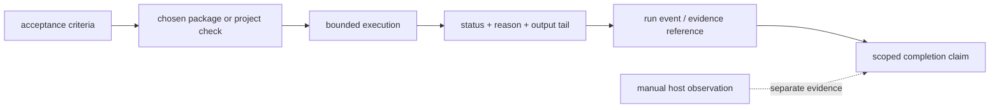

# Evidence and completion

Completion is a claim backed by evidence, not a green-looking status message.
LazyKimi separates package readiness from live-host behavior; that distinction
is the most important rule for interpreting results.

## Two kinds of evidence

| Evidence | What it can establish | What it cannot establish |
| --- | --- | --- |
| Package checks | Copied assets, declarations, inventories, contracts, and local scripts are present and valid. | That Kimi Code CLI or Kimi Work loaded the plugin, ran a hook, or connected MCP. |
| Host observation | A host UI or new session shows the skill and required MCP connection. | That every package check or workflow requirement passed. |

Run these from `lazykimi-plugin/` after `npm run build`:

```bash
node dist/index.js load-check
node dist/index.js doctor
node dist/index.js verify --must-pass
```

The expected package evidence is respectively `PACKAGE_READINESS=full` (or an
explained degraded state), `Doctor check: ALL PASS`, and aggregate JSON
containing `"all_pass":true`. The aggregate JSON also records a bounded
per-check status/reason; a timeout is failure, not proof of success.

Timeout cleanup is best-effort for trusted package-owned checks: the verifier
terminates the check's dedicated process group and records whether descendants
were still detectable. It is not a security sandbox or a guarantee that every
descendant has stopped. Use a VM or container-backed runner for genuinely
untrusted commands; no no-fork sandbox is enabled by default.

## The five evidence gates

Every completion must pass all five gates. Gates are mandatory; Sisyphus
cannot waive them. Oracle consolidates the gate review and issues the final
verdict.

| Gate | Name | Owner | Evidence required |
| --- | --- | --- | --- |
| 1 | plan-reread | Sisyphus (at resume) / Prometheus (at creation) / Momus (at execution entry) / Atlas (at reconstruction) | Plan file re-read end-to-end; every task has References + Acceptance Criteria + QA Scenarios + Commit instruction; all referenced paths exist |
| 2 | automated-verification | Hephaestus (or per-task executor) | LSP diagnostics clean on all changed files; related tests passing; full build green |
| 3 | manual-qa | Hephaestus (or per-task executor) | Real-surface artifact: CLI output, HTTP response, browser screenshot, or data output — concrete, not asserted |
| 4 | adversarial-qa | Oracle | Edge cases and regression scenarios executed with captured evidence |
| 5 | cleanup | Cleaner | No AI-slop remains; regression tests pass identically before and after; lint and type-check clean |

A failed gate blocks completion. Oracle returns ITERATE (max 3 fixable issues)
or REJECT (blocking). Sisyphus may not declare completion until all five gates
are PASS.

## Read the result at the right scope

Package readiness, doctor, and capability status are read-only package
evidence. They do not install a global integration, activate an optional
provider, export a host registration, or prove a running session. The six
local endpoints have JSON-RPC stream regression coverage, including
malformed-input recovery; that is endpoint protocol evidence, not a host
connection claim.

For Kimi Code CLI, confirm a LazyKimi skill and MCP status in a new session
after opening the project. For Kimi Work, verify a loaded Skills entry and
Agent Swarm session before relying on plugin capabilities. On the local
fallback, confirm imported skills and manually configured connectors. Full
routes are in [03 — Install and host verification](03-install-and-host-verification.md).

## Evidence during work

A reliable done claim names the requested outcome, changed files, exact
commands and results, real-surface/manual-QA observation where needed,
cleanup performed, and any remaining risk. A verifier should independently
reproduce the claimed checks and classify each outcome as pass, failure,
warning, not-applicable, or skipped with a reason.

`lazy-ulw-loop` turns open-ended work into goals with explicit success
criteria. `lazy-start-work` coordinates plan execution, evidence,
verification, and review. `lazy-reviewer` passes only when all review lanes
pass. These are workflow gates; they do not erase the host-boundary
requirement above.

## Scope and limits

Current verification scope is macOS. Normal CI does not require a sibling
repository. A release-only paired parity check may receive explicitly
supplied sibling roots for comparison, but that is neither a runtime nor
installation dependency. Do not describe a copied repository as a verified
Kimi Work plugin installer.

For check meanings, expected output, and exclusions, see
[09 — Test and release verification](09-test-and-release-verification.md).
For workflow selection, return to
[04 — Workflow playbooks](04-workflow-playbooks.md).

## Evidence data flow

Evidence is not a single boolean. The package carries several facts from a
check into the final report:



`lazykimi verify` constructs the aggregate status from individual result files
rather than parsing prose. State scripts preserve a run event/evidence
reference separately from verifier output. This lets a reviewer distinguish
"the package check passed," "the requested surface was observed," and "the
claim remains limited by an unverified host fact."
