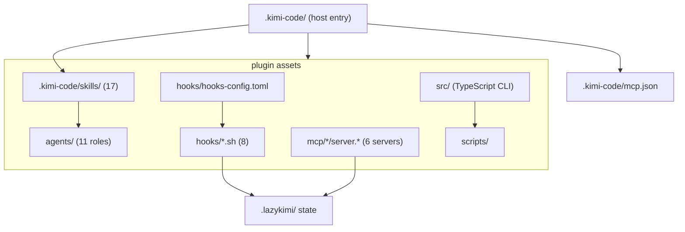

# Package map

`lazykimi-plugin/` is the only runtime package. Its directory layout mirrors
the way a host sees the harness: declarative workflow text, event adapters,
local executable services, and verification.

## Roles and events

`.kimi-code/skills/` and `agents/` are prompt-facing policy. Each describes a
bounded workflow and its expected evidence. `agents/` provides focused roles
mapped to Kimi Code CLI's three sub-agent channels. These files have no
process authority by themselves; they are loaded only if the host accepts the
package.

`hooks/hooks-config.toml` declares which host event may call a script. The
scripts under `hooks/` read structured input, apply narrow local policy, and
avoid treating untrusted text as a shell command. Their output is host advice
or local evidence, not proof that the host enforced the result.

## Local MCP inventory

The six declarations in `.kimi-code/mcp.json` launch package-local services:

| Server | Source boundary | Purpose |
| --- | --- | --- |
| `lazykimi-run-ledger` | Python stdio + state scripts | Read/write durable workflow records. |
| `lazykimi-verification` | Python stdio + verifier | Report bounded package checks. |
| `lazykimi-status-dashboard` | Python stdio + dashboard | Display package/run status. |
| `lazykimi-context-graph` | Python heuristic | Local grep-based relationships, not semantic CodeGraph. |
| `lazykimi-code-intel` | Python service | Local code-oriented helpers. |
| `lazykimi-docs` | Python registry client | Fixed-registry documentation lookup with SSRF boundaries. |

Each declaration is a recipe for a host. It becomes a service only when Kimi
Code CLI starts it over stdio. The `${KIMI_PLUGIN_ROOT}` variable resolves to
the `lazykimi-plugin/` directory.

## TypeScript CLI

`src/` contains the `lazykimi` CLI, compiled to `dist/index.js`. The CLI
provides six commands:

| Command | Purpose |
| --- | --- |
| `init` | Copy package assets into `.kimi-code/` and `.lazykimi/`. |
| `doctor` | Package health diagnostics. |
| `load-check` | Package readiness: inventories, declarations, executable scripts. |
| `verify` | Aggregate verification gate (doctor + load-check + MCP + hooks). |
| `mcp` | MCP server lifecycle inspection. |
| `uninstall` | Remove package-owned assets; preserve host state. |

The CLI is the package's control plane. It does not start MCP servers itself
— that is the host's job. It does not install hooks — that is
`scripts/install-hooks.sh`. It does not modify `~/.kimi-code/config.toml`
except through the explicit hook installer.

## Trace one request through the code

1. A user request selects a skill and, where applicable, a role definition.
   Kimi Code CLI dispatches to the appropriate sub-agent channel
   (`coder`, `explore`, or `plan`).
2. Host tool activity can produce a structured hook event. `pre-tool-use.sh`
   and `post-tool-use.sh` inspect supported fields, while the package avoids
   granting authority based on free-form text.
3. State helpers under `.lazykimi/state/` create or update a run, plan, task,
   event, or checkpoint. The boulder state file advances one task at a time.
4. `lazykimi verify` runs package-owned checks. Each check gets an owned
   process group, a deadline, JSON status/reason, and best-effort cleanup.
   This is not a security sandbox; untrusted commands need VM or
   container-backed isolation.
5. The tests invoke these boundaries from copied/isolated fixtures, so
   package readiness never relies on a sibling checkout or a live host.

## State locations

All LazyKimi runtime state lives under `.lazykimi/`. Configuration lives under
`.kimi-code/`. The two never mix.

| Artifact | Path | Owner | Format |
| --- | --- | --- | --- |
| Boulder state | `.lazykimi/state/boulder.json` | Sisyphus | JSON (`boulder.schema.json`) |
| Active loop state | `.lazykimi/state/active-loop.json` | Sisyphus | JSON (`active-loop.schema.json`) |
| Sessions ledger | `.lazykimi/state/sessions.json` | Sisyphus | JSON (`sessions.schema.json`) |
| Plan files | `.lazykimi/plans/<slug>.md` | Prometheus | Markdown |
| Evidence files | `.lazykimi/evidence/<gate>.md` | Per-gate owner | Markdown |
| Handoff summary | `.lazykimi/evidence/handoff.md` | Sisyphus | Markdown |
| Schemas | `.lazykimi/schemas/*.schema.json` | LazyKimi CLI | JSON Schema |
| Project config | `.kimi-code/` | LazyKimi CLI | Markdown + JSON |
| Agent definitions | `agents/lazykimi-*.md` | LazyKimi CLI | Markdown |

The boulder state file is the single source of truth for "where are we in the
plan?" — Atlas reconstructs from it, Sisyphus advances it, Oracle reads it to
verify plan compliance.

## Control-plane versus data-plane

LazyKimi has a useful internal split:

- The **control plane** is Markdown policy, manifests, command names, agent
  roles, the TypeScript CLI, and the hooks TOML fragment. It decides what is
  allowed and how a host should invoke the package.
- The **data plane** is structured hook input, run files, evidence records,
  JSON-RPC messages, subprocess output, and local search results. It carries
  work through narrow adapters.

This distinction explains why a command definition cannot directly mutate a
project, and why an MCP request cannot authorize a provider: each needs an
operational implementation that rechecks its own input and ownership boundary.
