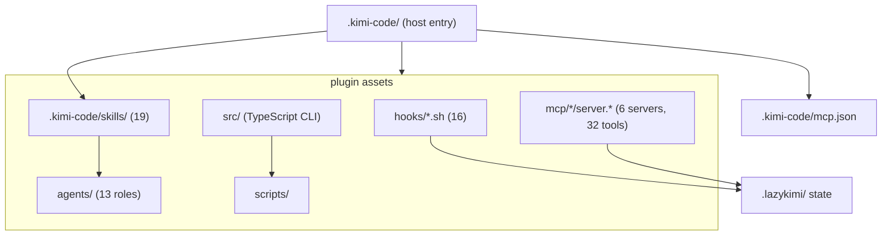

# Package map

`lazykimi-plugin/` is the only runtime package. Its directory layout mirrors
the way a host sees the harness: declarative workflow text, event adapters,
local executable services, and verification.

## Roles and events

`.kimi-code/skills/` and `agents/` are prompt-facing policy. Each describes a
bounded workflow and its expected evidence. `agents/` provides focused roles
mapped to Kimi Code CLI's three sub-agent channels. These files have no
process authority by themselves; they are loaded only if the host accepts the
package.

`hooks/` ships 16 hook scripts. Eight critical hooks are installed into
`~/.kimi-code/config.toml` by `scripts/install-hooks.sh`; the remaining eight
advisory hooks activate only through the plugin manifest. The scripts read
structured input, apply narrow local policy, and avoid treating untrusted text
as a shell command. Their output is host advice or local evidence, not proof
that the host enforced the result.

## Local MCP inventory

The six declarations in `.kimi-code/mcp.json` launch package-local services:

| Server | Source boundary | Purpose |
| --- | --- | --- |
| `lazykimi-run-ledger` | Python stdio + state scripts | Read/write durable workflow records. |
| `lazykimi-verification` | Python stdio + verifier | Report bounded package checks. |
| `lazykimi-status-dashboard` | Python stdio + dashboard | Display package/run status. |
| `lazykimi-context-graph` | Python heuristic | Local grep-based relationships, not semantic CodeGraph. |
| `lazykimi-code-intel` | Python service | Local code-oriented helpers. |
| `lazykimi-docs` | Python registry client | Fixed-registry documentation lookup with SSRF boundaries. |

Each declaration is a recipe for a host. It becomes a service only when Kimi
Code CLI starts it over stdio. The shipped template uses the
`__KIMI_PLUGIN_ROOT__` placeholder (Kimi does not interpolate environment
variables in `mcp.json`); `lazykimi init` rewrites it to the absolute
`lazykimi-plugin/` directory path at init time.

## TypeScript CLI

`src/` contains the `lazykimi` CLI, compiled to `dist/index.js`. The CLI
provides these commands:

| Command | Purpose |
| --- | --- |
| `init` | Copy package assets into `.kimi-code/` and `.lazykimi/`; rewrite `__KIMI_PLUGIN_ROOT__`; persist the MCP mode. |
| `doctor` | Package health diagnostics (hook wiring, MCP mode, honest host-readiness). |
| `load-check` | Package readiness: inventories, declarations, executable scripts. |
| `verify` | Aggregate verification gate (suite selector `core\|lifecycle\|all`). |
| `mcp` | MCP server lifecycle inspection. |
| `tooling` | Adaptive tooling layer: capability-status, codegraph lifecycle. |
| `lifecycle` | Durable onboard/update/status/offboard/recover-bootstrap-lock. |
| `sync` | Bridge v0.x user-managed state into the run-state model. |
| `handoff` | Parseable handoff summary from `.lazykimi/` state. |
| `completion-status` | Read the verification store's completion evidence. |
| `uninstall` | Remove package-owned assets; preserve host state. | |

The CLI is the package's control plane. It does not start MCP servers itself
— that is the host's job. It does not install hooks — that is
`scripts/install-hooks.sh`. It does not modify `~/.kimi-code/config.toml`
except through the explicit hook installer.

## Trace one request through the code

1. A user request selects a skill and, where applicable, a role definition.
   Kimi Code CLI dispatches to the appropriate sub-agent channel
   (`coder`, `explore`, or `plan`).
2. Host tool activity can produce a structured hook event. `pre-tool-use.sh`
   and `post-tool-use.sh` inspect supported fields, while the package avoids
   granting authority based on free-form text.
3. State scripts under `scripts/state/` create or update a run, task, event,
   or checkpoint under `.lazykimi/runs/<id>/`. Plan checkboxes advance one
   task at a time and stay authoritative.
4. `lazykimi verify` runs package-owned checks. Each check gets an owned
   process group, a deadline, JSON status/reason, and best-effort cleanup.
   This is not a security sandbox; untrusted commands need VM or
   container-backed isolation.
5. The tests invoke these boundaries from copied/isolated fixtures, so
   package readiness never relies on a sibling checkout or a live host.

## State locations

All LazyKimi runtime state lives under `.lazykimi/`. Configuration lives under
`.kimi-code/`. The two never mix.

| Artifact | Path | Owner | Format |
| --- | --- | --- | --- |
| Run state | `.lazykimi/runs/<id>/state.json` | state scripts | JSON (`active-run.schema.json`) |
| Event ledger | `.lazykimi/runs/<id>/events.jsonl` | hooks, state scripts, run-ledger MCP | JSON Lines |
| Checkpoints | `.lazykimi/runs/<id>/checkpoints/` | checkpoint script, compact hooks | JSON |
| Verification store | `.lazykimi/runs/<id>/verification/` | verification server, verifier | JSON + Markdown |
| Plan files | `.lazykimi/plans/<slug>.md` | planner | Markdown (checkboxes are task truth) |
| Evidence files | `.lazykimi/runs/<id>/evidence/` | per-gate owner | Markdown |
| Loop state | `.lazykimi/ulw-loop/` | loop scripts | JSON |
| v0.x schemas | `.lazykimi/schemas/*.schema.json` | LazyKimi CLI | JSON Schema (mapping in [reference/state-model.md](reference/state-model.md)) |
| Project config | `.kimi-code/` | LazyKimi CLI | Markdown + JSON |
| Agent definitions | `agents/lazykimi-*.md` | LazyKimi CLI | Markdown |

The plan file's checkbox state is the single source of truth for "where are we
in the plan?" — the context-indexer reconstructs from it, the orchestrator
advances it, the verifier reads it to confirm plan compliance.

## Control-plane versus data-plane

LazyKimi has a useful internal split:

- The **control plane** is Markdown policy, manifests, command names, agent
  roles, the TypeScript CLI, and the hooks TOML fragment. It decides what is
  allowed and how a host should invoke the package.
- The **data plane** is structured hook input, run files, evidence records,
  JSON-RPC messages, subprocess output, and local search results. It carries
  work through narrow adapters.

This distinction explains why a command definition cannot directly mutate a
project, and why an MCP request cannot authorize a provider: each needs an
operational implementation that rechecks its own input and ownership boundary.
