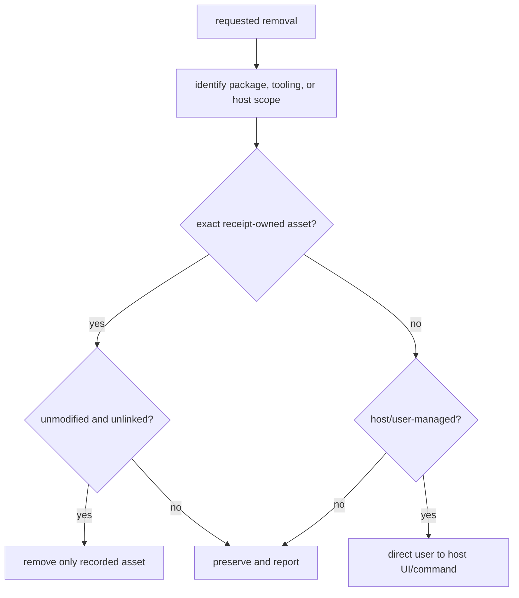

# Safe removal

Remove host-managed integration through its host, and remove package-owned
tooling only when its receipt proves ownership. These are separate operations.

## Remove by installation route

| Route | Safe action | Preserve |
| --- | --- | --- |
| Kimi Code CLI project configuration | Run `lazykimi uninstall --yes`; then remove the eight `[[hooks]]` entries from `~/.kimi-code/config.toml` and remove each `lazykimi-*` MCP server via `/mcp-config`. | `~/.kimi-code/` global state, credentials, unrelated MCP entries, and host configuration. |
| Kimi Work imported skills | Remove imported LazyKimi skills through the Skills UI; remove manually configured MCP connectors through Kimi Work's MCP configuration. | Other imported skills, connectors, and host settings. |
| Receipt-owned tooling root | Run the package uninstall command only for the exact owned root. | Modified, foreign, linked, caller-owned, project, global, and host-managed paths. |

## Package uninstall

```bash
lazykimi uninstall --yes
```

The command removes only package-owned assets under `.kimi-code/` and
`.lazykimi/` that match an exact ownership receipt. It checks for an exact
ownership receipt and owned contents; it does not use a path name as proof of
ownership. If a root is modified, linked, foreign, or caller-owned, it is
preserved rather than removed.

## Manual host step

After the package uninstall, perform the manual host step:

### Kimi Code CLI

1. Open `~/.kimi-code/config.toml` in a text editor.
2. Remove the eight `[[hooks]]` entries whose `command` field references
   `.kimi-code/hooks/`. These correspond to SessionStart, UserPromptSubmit,
   PreToolUse, PostToolUse, Stop, SubagentStop, PreCompact, and PostCompact.
3. Save the file.
4. In a Kimi Code CLI session, run `/mcp-config` and remove each
   `lazykimi-*` MCP server entry.
5. Restart the Kimi Code CLI session.

### Kimi Work

1. Open Kimi Work's Skills UI.
2. Remove each imported LazyKimi skill.
3. Open Kimi Work's MCP configuration.
4. Remove each manually configured `lazykimi-*` MCP connector.

## What not to remove

Never guess or scan for host-managed installation paths. Do not delete
`~/.kimi-code/` global state, `~/.kimi-code/config.toml` provider/model
configuration, credentials, another host's MCP configuration, project files,
global tools, or API keys. Removing a tooling root does not authorize removal
of a plugin, marketplace installation, MCP registration, or credential state.

## Confirm the result

Report **package removal** separately from the **user-observed host result**.
After using a host removal UI, confirm that the skills, hooks, and manually
configured connectors are gone in that host. Only then may the copied
repository be deleted; it is independent of host removal and is not itself a
host installer.

## Removal decision flow



The important implementation rule is that a refusal is a successful safety
outcome. `lazykimi uninstall` validates an explicit root and receipt before
deleting package assets; it never turns a filename match, parent directory,
or host plugin name into ownership. Host removal remains a separate user
action because the package cannot safely enumerate host-managed installation
paths.

Read [03 — Install and host verification](03-install-and-host-verification.md)
for the exact boundaries and [06 — Capabilities and approvals](06-capabilities-and-approvals.md)
for the MCP inventory.
