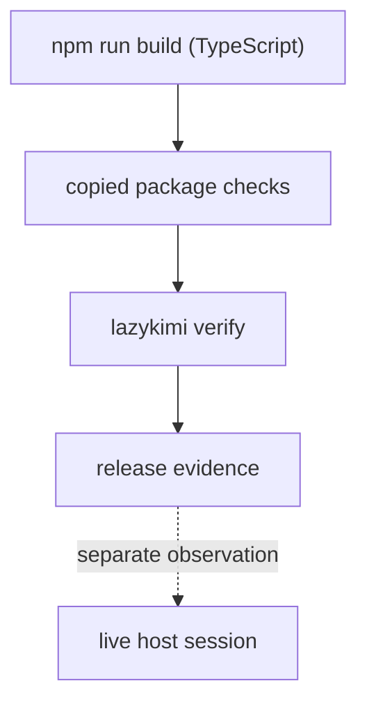

# Test and release verification

LazyKimi uses layered evidence. A release check is useful only when its scope
is explicit: a syntax check does not prove a protocol, a protocol fixture
does not prove a host connection, and host observation does not rewrite
package ownership.



## Build verification

The TypeScript CLI must build cleanly before any package check is meaningful:

```bash
cd lazykimi-plugin
npm install
npm run build
```

The build emits `dist/index.js`, which is the `lazykimi` CLI entry point. A
failed build invalidates all downstream checks — `load-check`, `doctor`, and
`verify` all depend on `dist/index.js` existing.

## Read the aggregate result

`lazykimi verify` calls doctor, load-check, MCP protocol, hook pipeline, and
classified regression checks. It uses bounded execution for package-owned
checks so the JSON result contains a status and reason instead of a bare exit
code. A timeout or failed check is a failure; an unavailable host-side
validator is reported as an unchecked condition rather than a fabricated host
success.

The verifier's timeout cleanup is **best-effort** process-group cleanup. It is
**not a security sandbox** and does not guarantee descendant cleanup. Tests
that need to execute untrusted input need a **VM or container-backed runner**.

## Verification commands

```bash
# From lazykimi-plugin/ after npm run build.
node dist/index.js load-check     # package readiness
node dist/index.js doctor         # package health
node dist/index.js verify --must-pass   # aggregate gate
```

The expected package evidence is respectively `PACKAGE_READINESS=full`,
`Doctor check: ALL PASS`, and aggregate JSON containing `"all_pass":true`.

## CI workflow

The CI workflow at `.github/workflows/ci.yml` runs on every push and pull
request to `main`:

```yaml
jobs:
  test:
    runs-on: macos-latest
    steps:
      - uses: actions/checkout@v4
      - uses: actions/setup-node@v4
        with:
          node-version: '22'
      - run: cd lazykimi-plugin && npm install
      - run: cd lazykimi-plugin && npm run build
      - run: cd lazykimi-plugin && bash scripts/lazykimi-verify.sh
```

CI runs on macOS-latest with Node 22, matching the package's verified scope.
A failed build or failed verify gate blocks merge.

## Release boundary

Normal CI is self-contained: it does not require a sibling repository.
Documentation and contract parity with LazyBuddy and LazyTrae are release-only
paired parity checks, run only when both absolute roots are explicitly
supplied. That keeps the shared safety contract auditable without creating a
runtime, installer, or CI dependency between packages.

The final host layer is intentionally manual. A Kimi Code CLI or Kimi Work
session must show the selected plugin surface, hook behavior where relevant,
and MCP connection before those facts are claimed. Current package evidence
is verified on macOS only.

## Verification matrix

| Check | Scope | What it proves | What it does not prove |
| --- | --- | --- | --- |
| `npm run build` | TypeScript compilation | The CLI compiles without type errors. | Runtime behavior or host loading. |
| `load-check` | Package inventory | Copied assets, declarations, and executable scripts are present. | Host discovery or MCP connection. |
| `doctor` | Package health | Manifests, JSON, and tooling contract are valid. | Live host session. |
| `verify --must-pass` | Aggregate gate | All package checks pass with bounded status. | Host integration or hook execution. |
| MCP protocol regression | JSON-RPC stream | Endpoints handle malformed input and recover. | Host process launched or connected. |
| Hook pipeline | Hook scripts | Scripts execute and apply policy on fixtures. | Host loaded `~/.kimi-code/config.toml`. |
| Manual host observation | Live session | Skill, hook, and MCP are loaded in the host. | Every package check passed. |

## How to read a regression by boundary

The shell regressions are intentionally named by the boundary they attack,
not by an implementation detail:

| Regression family | Fixture/action | Failure it prevents |
| --- | --- | --- |
| package/readiness | copied package root and manifest checks | Source checkout assumptions or missing shipped assets. |
| hook/security | structured tool payloads and secret-like paths | Treating arbitrary text as a write target or command authority. |
| MCP params/SSRF | malformed JSON-RPC and attacker-controlled metadata | Stream poisoning or registry metadata becoming a network target. |
| bounded verifier | timeout and process fixtures | Reporting timeout as success or claiming guaranteed cleanup. |

When a regression fails, start from its fixture and expected assertion, then
follow the smallest source function named in the failure. Do not "fix" a
release check by weakening its assertion: each assertion encodes a published
ownership or evidence contract.

## Family test-stack port: inventory and skip list (v1.3.3)

The v1.3.3 test stack mirrors the lazyzcode layout: `tests/*.test.js`
(node:test), `tests/test_lazykimi_*.py` plus `tooling/test_lazykimi_*.py`
(pytest, python3.10+ resolved by `scripts/lazykimi-python-resolver.sh`),
`tests/v*.sh` and `tests/publication-regression.sh` (bash), `tests/fixtures/`,
and `scripts/assets/` fixture libraries. Existing `v001`–`v003` regressions
keep their numbers; ports new in v1.3.3 use the `v103*` family prefix.

Current committed inventory: 32 node:test files, 26 pytest files (15 in
`tests/`, 11 in `tooling/`), and 41 bash regressions (24 historical `v001`–
`v003` + 17 `v103`/`v2`/`v104`/publication ports), of which the paired-only
parity checks and the publication regression run outside the normal suite
selector. The repo-root product-naming guard also runs as a first-class
verify phase (`product_naming`) in the `core` and `all` suites.

Verify suites stay `all | core | lifecycle`. LazyZCode's fourth `language`
suite is intentionally NOT ported as a selector: its content (package node
tests + contract tests + pytest) is exactly what lazykimi's `all` suite runs,
so a duplicate selector would add drift risk without adding coverage.

Skipped lazyzcode tests, with reasons:

| Skipped lazyzcode test | Reason |
| --- | --- |
| `v015-consumer-agents-regression.sh` | Exercises `scripts/ensure-consumer-agents.sh` and ZCode consumer-agent injection at session start; lazykimi ships its 13 family agents statically and has no consumer-agent ensurement machinery. |
| `v110-six-host-contract-parity.sh` (+ `-regression.sh`) | Gates the LazyTrae/LazyZCode sibling pair by explicit root; lazykimi's family parity runs through `v103-automatic-tooling-contract-parity.sh`, `v103-lifecycle-contract-parity.sh`, and `v2-lifecycle-contract-parity.sh` against LazyZCode. |
| `host-capability-routes.test.js` | Enumerates the ZCode host-capability route table; lazykimi's host surface is Kimi-only and is asserted by `marketplace-route-contract.test.js` and `v110-machine-status.test.js`. |
| `product-naming.test.js` | Replaced by the repo-root naming guard ported in T20 (`scripts/check-product-naming.js` + `.product-naming-allowlist.json` + its negative test), which covers the whole active surface instead of test-local fixtures. |
| `zcode-connector-reference.test.js` | ZCode connector-manifest specifics with no Kimi counterpart (Kimi Work connectors are documented in `docs/reference/host-routes.md` and verified on-host in T21). |
| `zcode-observation-bundle.test.js` | ZCode observation-bundle packaging; lazykimi's equivalent receipt machinery (`kimi-observation*`, `kimi-receipt.js`) is covered by `lifecycle-host-handoff.test.js` and `kimi-receipt-path.test.js`. |
| remaining `v015`–`v12x` host/UI regressions (cwd-injection, capability broker/detector, provider lifecycle, LSP, remote capabilities, zcode package preparation, zcode observation bundle, state-task schema, etc.) | They drive ZCode host surfaces (ZCode UI hooks, ZCode capability broker, ZCode provider registry) that lazykimi does not ship; the Kimi equivalents are covered by the ported `v103-*` set, the six MCP servers' own contract tests, and `lazykimi-hook-pipeline-test.sh`. |

Ported-and-renamed (not skipped): `zcode-receipt-path.test.js` becomes
`kimi-receipt-path.test.js` with the same private-path refusal semantic against
`.kimi-code/` receipt locations.
